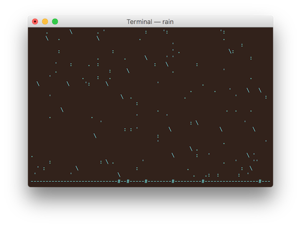

# rain

Display an ascii art animation of rain in a terminal

# about

`rain` is a tiny C program inspired by `cmatrix`. It displays an ascii
art animation of falling rain in a terminal.



# usage

Clone the repository and run `make`. Requires ncurses.

Press `q` to exit.

```
rain [args]

args:
-c COLOR   set the rain color (defaults to 04--blue)
-d [1,2,3] set the rain direction (defaults to random)
-h         print program usage
-m         set monochrome mode (overrides -c)
-t RATE    set the update rate to RATE milliseconds
-r RATE    set the rain rate (defaults to 15)
-v         print program version
```
